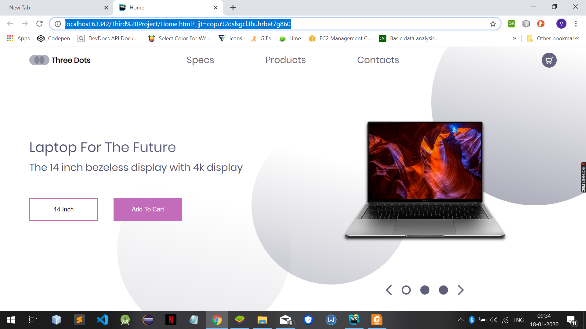
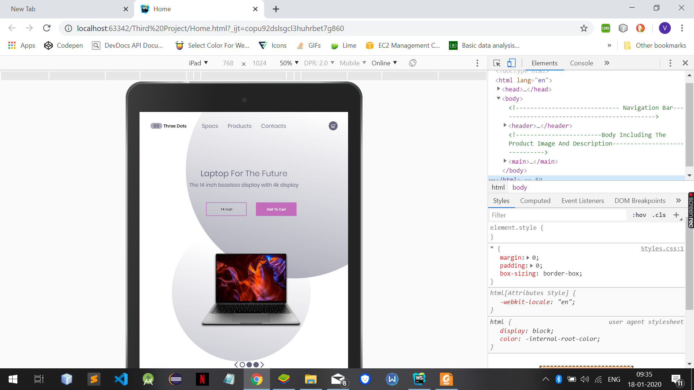
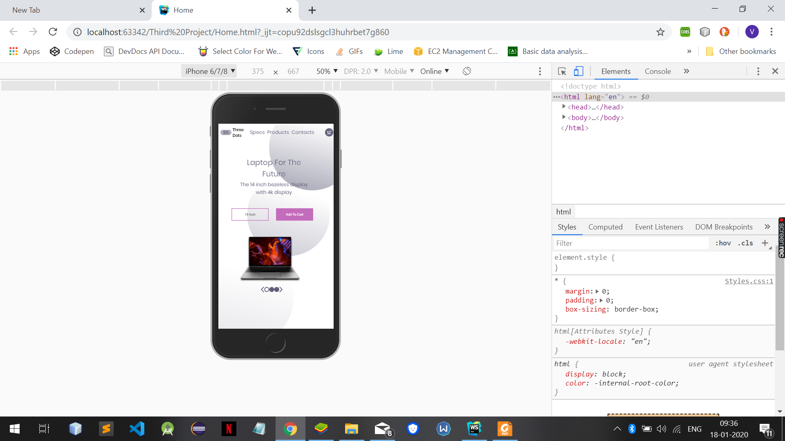

# Laptop Website Responsive Homepage

## The page has been made mobile firendly using only HTML5 and CSS3. The screen shots showing the page have been attached below:-

### Note:- The images used were provided as the part of the tutorial that I followed to learn web development.
